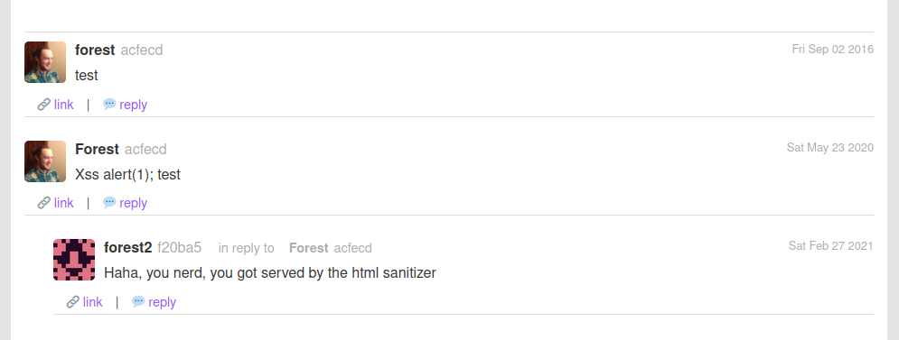
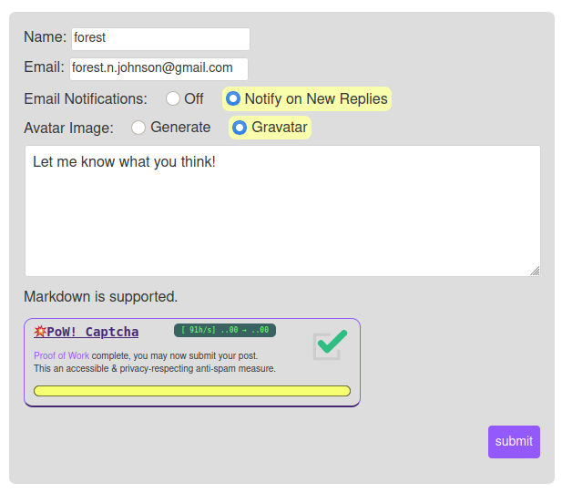
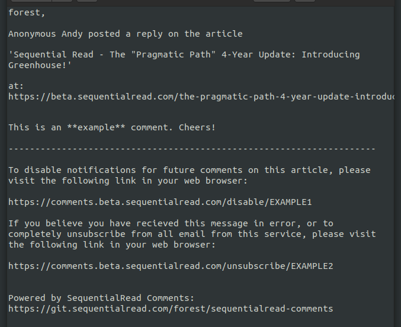
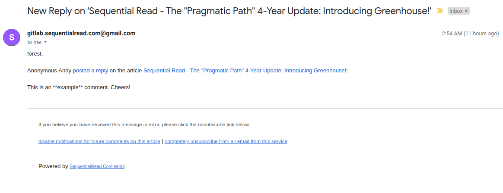
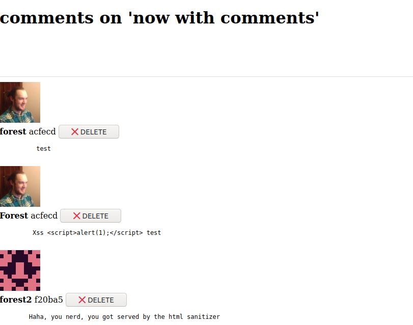

# SequentialRead Comments

Lightweight and easy-to-use blog comments system, low friction, easy to self-host, GPLv3 Licensed, respects users.

# Table of Contents

 1. [Features](#features)
 1. [Screenshots](#screenshots)
 1. [Configuration](#configuration)
 1. [HTML DOM API](#html-dom-api)
 1. [HTTP API](#http-api)

# Features

#### Easy to Implement 

 - No need to set up a database, it uses the [BoltDB embedded database](https://github.com/boltdb/bolt)
 - [Docker images provided](https://hub.docker.com/r/sequentialread/comments) for `amd64`, `arm64`, and `armv7` based machines running Linux
 - Embed in any HTML page with just a `<div>` and a `<script>` tag
 - Email notification feature is optional

#### Respects Users 

  - [Gravatar](https://gravatar.com/) is supported, commenter decides whether to use it or not. Off by default.
  - Commenter chooses whether or not receive email notifications on subsequent replies
    -  If they choose not to recieve notifications, [their email address will not be stored](https://git.sequentialread.com/forest/sequentialread-comments/src/b0bd22106210dcd71c47dc48959939276ece7d3d/main.go#L306)
  - All email notifications come with two opt-out links, one for the document in question, and one for the entire app
  - Uses [💥PoW! Captcha](https://git.sequentialread.com/forest/sequentialread-pow-captcha), a Proof-of-Work-based alternative to tracking & analytics captchas like Google's ReCaptcha.

#### Simple, but not *TOO* Simple

  - No Account or email address required to comment
    - Email address field provides some form of persistent identity if it is used
  - The comment body is the only required field
  - [Markdown](https://www.markdownguide.org/getting-started/) & HTML is supported inside the comment body
    - The HTML is sanitized before being displayed
    - All other dynamic fields use the [`.textContent` DOM property](https://developer.mozilla.org/en-US/docs/Web/API/Node/textContent) to prevent XSS attacks
  - Admin email notifications & web-based Admin interface allows for basic moderation

# Screenshots

#### Comments



----

#### Post Comment Form



----

#### Notification Email

Notification emails are sent with both plain text and HTML for best compatibility an readability:



And here is the HTML rich text email:



----

#### Admin Interface

Yes, beautiful, I know :D 



----

# Configuration

SequentialRead Comments is configured via environment variables.

Note that when the application is started, the current working directory must contain the `static` and `data` folders as well as the `admin.html.gotemplate` file. Otherwise the application will not work properly.

If you run SequentialRead Comments inside a Docker or other type of Linux container, you will want to mount the `data` folder to some sort of persistent volume so you don't lose all of your users' comments when the container has to be replaced/upgraded! 

#### COMMENTS_LISTEN_PORT

Which TCP port the server should listen on. Must be an Integer.

----

#### COMMENTS_BASE_URL

The full URL to the root of where the application is served from. For example `https://comments.mydomain.com`
If `COMMENTS_BASE_PATH` is set, for example, to `/comments`, then it might be something like `https://mydomain.com/comments`.

This variable is required for the email notification feature.

----

#### COMMENTS_CORS_ORIGINS

The list of origins from which the server will tell Web Browsers to [allow Cross-Origin requests](https://developer.mozilla.org/en-US/docs/Web/HTTP/CORS). 
If you host the comments server on a different domain from the pages it is used on, you must set this variable.

You would set it to a comma-delimited list of origins, like `https://sequentialread.com,https://www.sequentialread.com,https://beta.sequentialread.com,https://www.beta.sequentialread.com`

----

#### COMMENTS_CAPTCHA_API_TOKEN

The hexadecimal string which was obtained by [creating a new API token on the 💥PoW! Captcha server](https://git.sequentialread.com/forest/sequentialread-pow-captcha#http-admin-api)

----

#### COMMENTS_CAPTCHA_URL

Currently this variable is used for two different things.

1. It is used to contact the captcha server & get captcha challenges.
2. It is used to load the captcha JavaScript and CSS into the page.

For that reason, this URL must be reachable from both the comments server and the public internet at large. This may change in the future, let me know if this causes a problem for you. Or you can just fix it yourself 😇

----

#### COMMENTS_CAPTCHA_DIFFICULTY_LEVEL

This controlls how difficult the [Proof of Work](https://git.sequentialread.com/forest/sequentialread-pow-captcha#what-is-proof-of-work) required to solve the captcha will be. The recommended value is `5` or `6`.
Each time you increase the difficulty level by one, it doubles the average amount of time the captcha will take.

----

#### COMMENTS_EMAIL_HOST
#### COMMENTS_EMAIL_PORT
#### COMMENTS_EMAIL_USER
#### COMMENTS_EMAIL_PASSWORD

These are standard SMTP submission connection & authentication parameters. They are all required to be set for the email notification feature to work.

If `COMMENTS_EMAIL_PORT` is set to 465, then "normal" SMTP will be used, that is, `SMTP+STARTTLS`. Otherwise, SMTP-wrapped-inside-TLS (`SMTPS`) will be used.

If you don't know what to put here, you can use a gmail account for this in a pinch. I would recommend creating a separate dedicated account for notifications. To set it up, use:

  - `COMMENTS_EMAIL_HOST=smtp.gmail.com`
  - `COMMENTS_EMAIL_PORT=465`
  - set `COMMENTS_EMAIL_USER` to your gmail email address
  - set `COMMENTS_EMAIL_PASSWORD` to your gmail password

In order for this to work, the gmail account you are using cannot have multifactor authentication turned on. You will also have to [enable "Allow less secure apps" in your google settings](https://myaccount.google.com/lesssecureapps).

If you are getting any kind of busy traffic w/ lots of people posting comments, you will probably irritate google very quickly by doing this, so you should set up a real notification email provider instead.

----

#### COMMENTS_NOTIFICATION_TARGET

This email address will recieve an email every time a comment is posted.

----

#### COMMENTS_ADMIN_PASSWORD

The password for the `admin` user on the web-based admin panel. If it is not provided then the admin panel will be turned off.

----


# HTML DOM API

#### `id="sqr-comment-container"`

`comments.js` looks for a DOM element (like a `<div>`, for example) **with the id `sqr-comment-container`** as soon as it loads.
This DOM element must also hava a [data attribute](https://developer.mozilla.org/en-US/docs/Learn/HTML/Howto/Use_data_attributes) called `data-comments-url`.

#### `data-comments-url`

This property must be set to a URL of the form `<COMMENTS_BASE_URL>/api/<DocumentID>`

Each time the comments are instantiated on a page, the script needs to know a unique id associated with the page it is on. This way, if the URL of the page changes, the existing comments will not be lost. This is the `DocumentID`.

I developed SequentialRead comments for use with the [Ghost](https://github.com/TryGhost/Ghost) blogging software. Ghost provides a property called `id` on every post, so all I had to do was edit the [Handlebars](https://handlebarsjs.com/) template for my Ghost theme and [insert that `id` property into the url on my `data-comments-url` attribute](https://git.sequentialread.com/forest/sequentialread-caddy-config/src/7839b4f9c51201b461a80babe06a8a87ffbf0aa6/ghost-theme/partials/addons/comment.hbs) like so:

```
<section class="comment">
    <div
      class="container limit-width"
      id="sqr-comment-container"
      data-comments-url="https://comments.beta.sequentialread.com/api/{{id}}">
    </div>
    <script src="https://comments.beta.sequentialread.com/static/comments.js"></script>
</section>
```

And that's it, that's really all you have to do to include the comments section on your page. 

If you wish to use the path part of the URL as the `DocumentID`, you will have to get clever with a bit of JavaScript, something like this:

```
<div id="sqr-comment-container"></div>
<script>
    // Set the documentId based on the URL and ensure it does not contain any slashes.
    var documentId = window.location.pathname.substring(1).replaceAll("/", "_");

    // Set the data-comments-url property based on the generated documentId
    document.getElementById("sqr-comment-container").dataset.commentsUrl = "https://comments.mysite.com/api/"+documentId;
</script>
<script src="https://comments.mysite.com/static/comments.js"></script>
```

So for example, for the page `https://mysite.com/myProduct/blog/check-out-our-new-blog-commetns-system?q=about#about-us`

The `DocumentID` would be `myProduct_blog_check-out-our-new-blog-commetns-system`. If that page was moved to a different URL, for example because someone mis-spelled `commetns` in the URL, then the `DocumentID` would change and the existing comments would be lost. 

----

# HTTP API

This section is a stub. See source code for details. You don't need to interact with the HTTP API in depth in order to use this product.

All of the routes under `/admin` require [HTTP Basic Authentication](https://developer.mozilla.org/en-US/docs/Web/HTTP/Authentication#basic_authentication_scheme). Username will be `admin` and password will be whatever you set for [`COMMENTS_ADMIN_PASSWORD`](#comments_admin_password).

#### `GET /api/<DocumentID>`

Get the JSON list of comments for a document.

----

#### `POST /api/<DocumentID>`

Post a new comment.

----

#### `GET /admin`

Display the list of documents that have comments.

----

#### `GET /admin/<DocumentID>`

Display the list of comments for a document

----

#### `POST /admin/<DocumentID>`

Delete a comment.

----

#### `GET /avatar`

Get an avatar image.

----

#### `GET /disable/<token>`

Disable email notifications for a given user for a given post.

----

#### `GET /unsubscribe/<token>`

Disable email notifications for a given user.

----

#### GET /static/<filename>

Get a static file like JavaScript, CSS, or the anonymous user avatar.